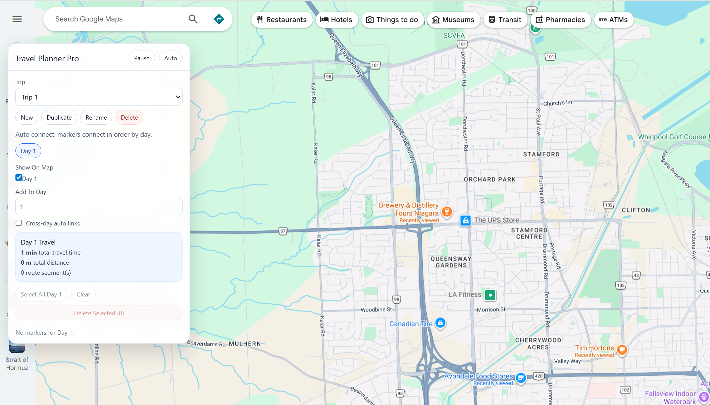
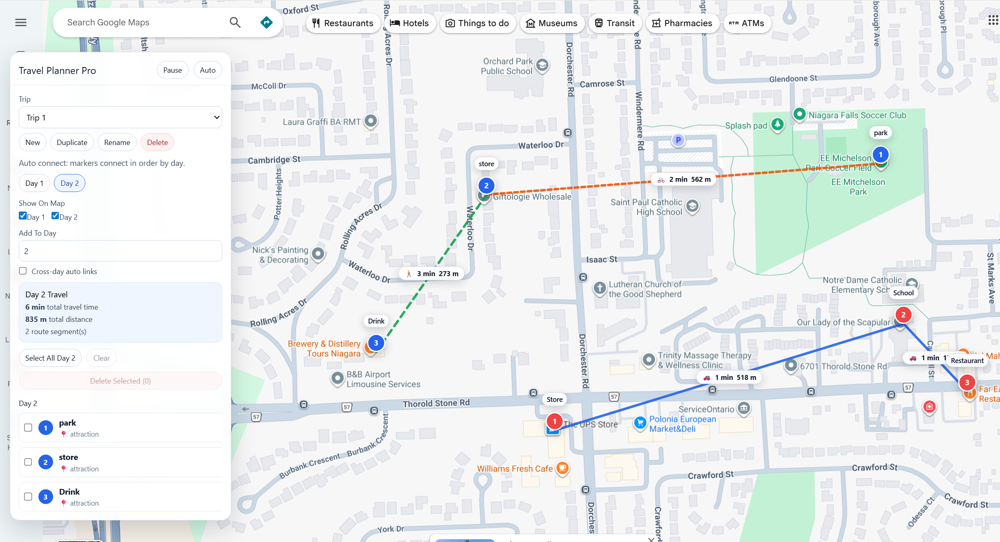

# Maps Travel Planner Extension

A Chrome extension that enhances Google Maps with a visual travel planning system.

## Features

- Add markers with notes and categories
- Connect locations with routes
- Choose travel modes (driving, walking, biking, transit)
- Route labels showing time and distance directly on the map
- Multi-day trip planning
- Drag-and-drop itinerary ordering
- Manual graph-based routing
- Pause mode for normal Google Maps use
- Auto-save trips

## Installation

1. Clone or download this repository.
2. Open Chrome and go to `chrome://extensions`.
3. Enable Developer Mode.
4. Click **Load unpacked**.
5. Select this project folder.
6. Open Google Maps.

## Tech Stack

- Chrome Extension (Manifest V3)
- React
- Google Maps overlay integration

## Limitations

- Desktop only
- Depends on Google Maps UI structure

## Future Plans

- Web app version
- Mobile app
- Route optimization
- Sharing trips

## Demo

## Author

Peiyun Li
